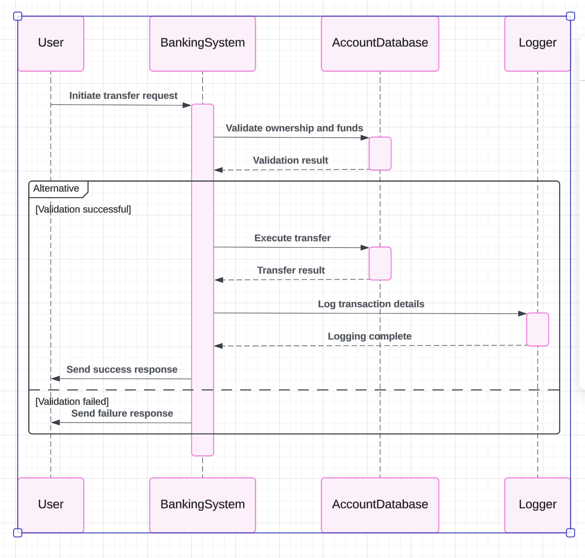
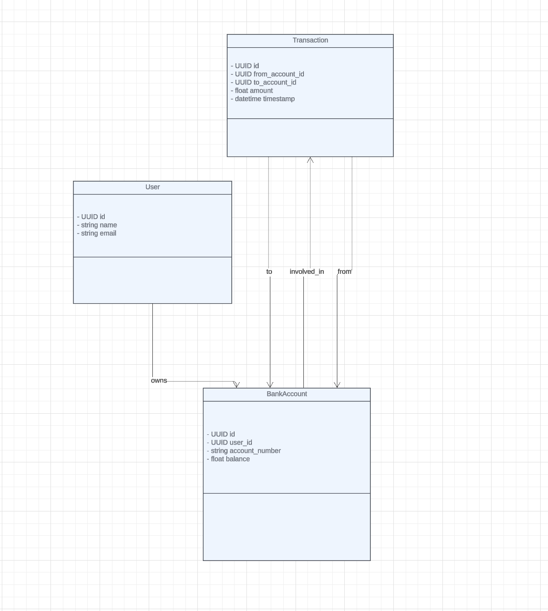

# FastAPI Bank Management Application
This application is a simple, lightweight Bank Management API built with FastAPI and SQLAlchemy. It offers a Web API to allow our users to view their Bank Accounts and the transaction history of their accounts. It is designed with a focus on simplicity, flexibility, and performance, and is ready for containerization with Docker.

## About
- 📦 This app has been refactored for containerization, promoting consistent operating environments and seamless deployments using [Docker](https://www.docker.com/).
- 🚀 This app uses the [FastAPI](https://fastapi.tiangolo.com/) framework. FastAPI is a high-performance web framework for building APIs with Python 3.6+ that provides built-in support for asynchronous code. It is highly extensible and compatible with REST, OpenAPI, GraphQL, gRPC, and other protocols.
-  ✅ This app uses [Pydantic](https://docs.pydantic.dev/) data validation. Pydantic provides a declarative way to define data schemas and models that can be used across different protocols and API styles. The use of Pydantic models also allows FastAPI to automatically generate API documentation, perform data validation, and serialize/deserialize request and response data, making it easier to build and maintain high-performance APIs.
-  💾 This app leverages [SQLAlchemy](https://www.sqlalchemy.org/) for data persistence. A comprehensive ORM implementation is included to automate the interaction with the PostgreSQL database. The SQLAlchemy ORM provides a high-level, Pythonic interface to the database, while still allowing for complex, lower-level SQL constructs. This integration of SQLAlchemy with our Docker containerization process ensures the app is fully equipped to handle complex data structures and queries, making it a powerful, ready-to-run, fully containerized app.
-  🗃️ This app leverages [PostgreSQL](https://www.postgresql.org/) for data persistence. A comprehensive initialization script is included to automate the setup of the PostgreSQL database. The script creates a database user, database, and the database table. This integration of the script with our Docker containerization process means the app is fully prepared for container-based deployment, complete with its database setup, epitomizing a ready-to-run, fully containerized app.

## Prerequisites
- [Install Docker](https://docs.docker.com/get-docker/)
- [Install Docker Compose](https://docs.docker.com/compose/install/)

## Installation
1. Clone the repository.
```
git clone https://github.com/aws-samples/python-fastapi-demo-docker.git
```
2. Navigate into the project directory and make a copy of the example environment variables file.
```
cd python-fastapi-demo-docker
cp .env.example .env
```
The .env file contains the database credentials. You can modify these credentials if necessary.

## Quickstart
These steps show how to set up the database and the application using Docker.

1. In the project root directory, build the Docker images.
```
docker-compose build
```

2. Run the Docker containers.
```
docker-compose up
```
At this point, the application should be running at [http://localhost:8000/](http://localhost:8000/). To stop the application, you can run:
```
docker-compose down
```
3. To restart or rebuild the application, you can run:
```
docker-compose up --build
```

## Documentation
FastAPI autogenerates an OpenAPI specification, which allows you to test this application directly from an interactive console in your browser. It uses the [Pydantic](https://docs.pydantic.dev/) model to validate user input (as shown in the models section of the specification, below). Go to [http://0.0.0.0:8000/docs](http://0.0.0.0:8000/docs) to use the automatic interactive API documentation for this application (provided by [Swagger UI](https://github.com/swagger-api/swagger-ui)) to send requests. 

### Sequence Diagram




### Class Diagram




### GET /users/{user_id}/accounts
This endpoint displays the details of accounts of a particular user specified by the user_id.

### POST /transfer
This endpoint creates a transfer from one account to another

